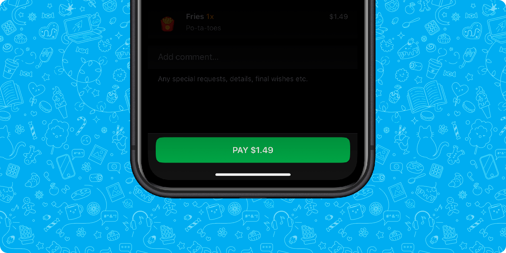

# Main Button



The Main Button is a component that is usually used when it is necessary to perform some final action.

An example of the use case of this component is sending data. For example, a Mini App may involve selecting products from a catalog and filling a user's shopping cart. At the moment when products appear in the cart, the developer can display the Main Button, clicking on which will cause the creation and processing of the order.

This is a moderately sized yet simple component that offers limited functionality. The developer has the ability to control the button text, its active state, button and inner loader visibility. It is also possible to update text and background colors.

To update any of the Main Button properties, Dejoy Mini Apps provides the [web_app_setup_main_button](../apps-communication/methods.md#web_app_setup_main_button) method. When user clicks the Main Button, Dejoy application emits the [main_button_pressed](../apps-communication/events.md#main_button_pressed) event.

```
TIP

If clicking the button produces an action that takes some time to complete, it is recommended to display the loader inside the Main Button. This will allow the user to understand that the application is not frozen and is currently performing an operation.
```