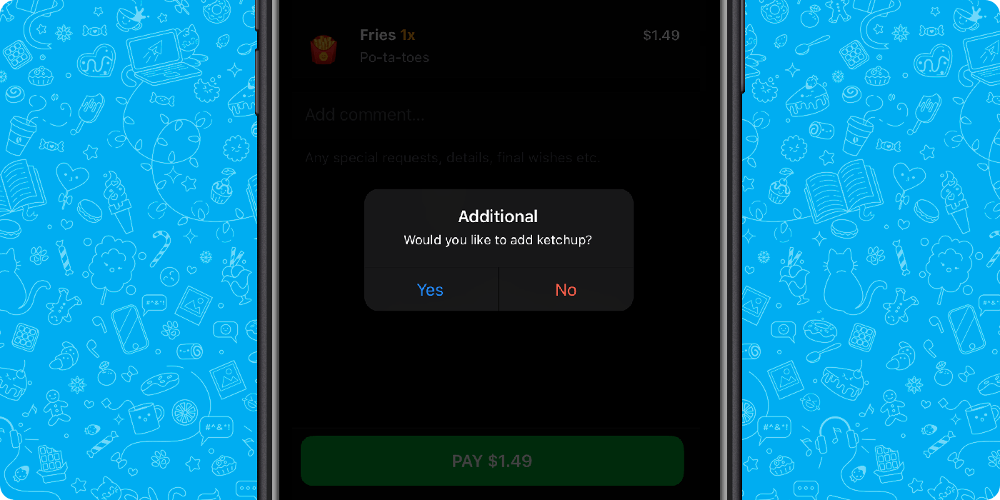

# Popup

Popup is a component that is located on top of the Mini App. Its classic use case is a request for user confirmation to perform an action. Dejoy Mini Apps allows specifying popup title, message and the list of up to 3 configurable buttons.

To show the popup, developer can utilize [the web_app_open_popup](../apps-communication/methods.md#web_app_open_popup) Dejoy Mini Apps method. When user presses any popup button, Dejoy application emits the [popup_closed](../apps-communication/events.md#popup_closed) event passing the identifier of the clicked button.