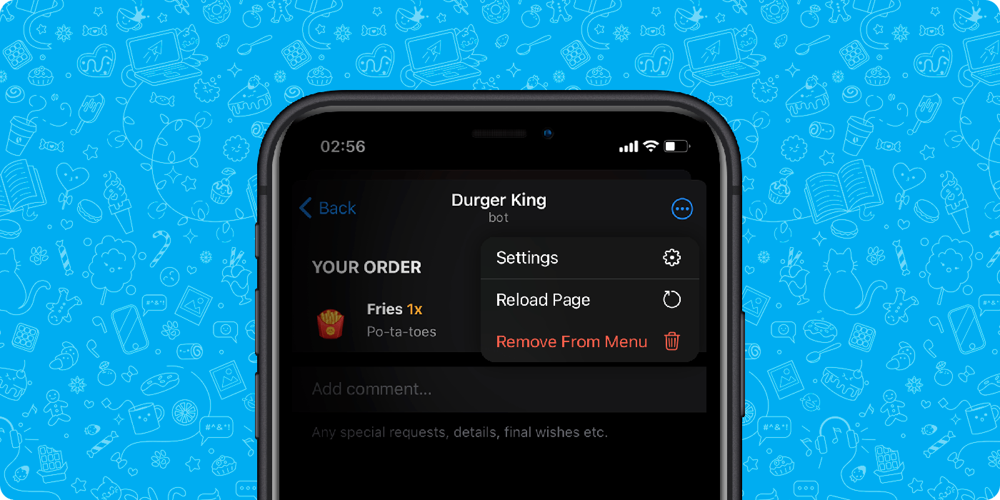

# Settings Button

The Settings Button is a component displayed in the top right menu of the Mini App interface. Like many other Dejoy Mini Apps components, this button does not have a built-in action, and it's up to the developer to decide how to handle a click on this button.

Until Dejoy Mini Apps version 6.10, this button was only displayed for Mini Apps belonging to Dejoy Ads' major advertisers' bots. Starting from version 6.10, all developers have the option to display this button using the [web_app_setup_settings_button](../apps-communication/methods.md#web_app_setup_settings_button) method.

When a user clicks the Settings Button, the Dejoy application emits the [settings_button_pressed](../apps-communication/events#settings-button-pressed) event.