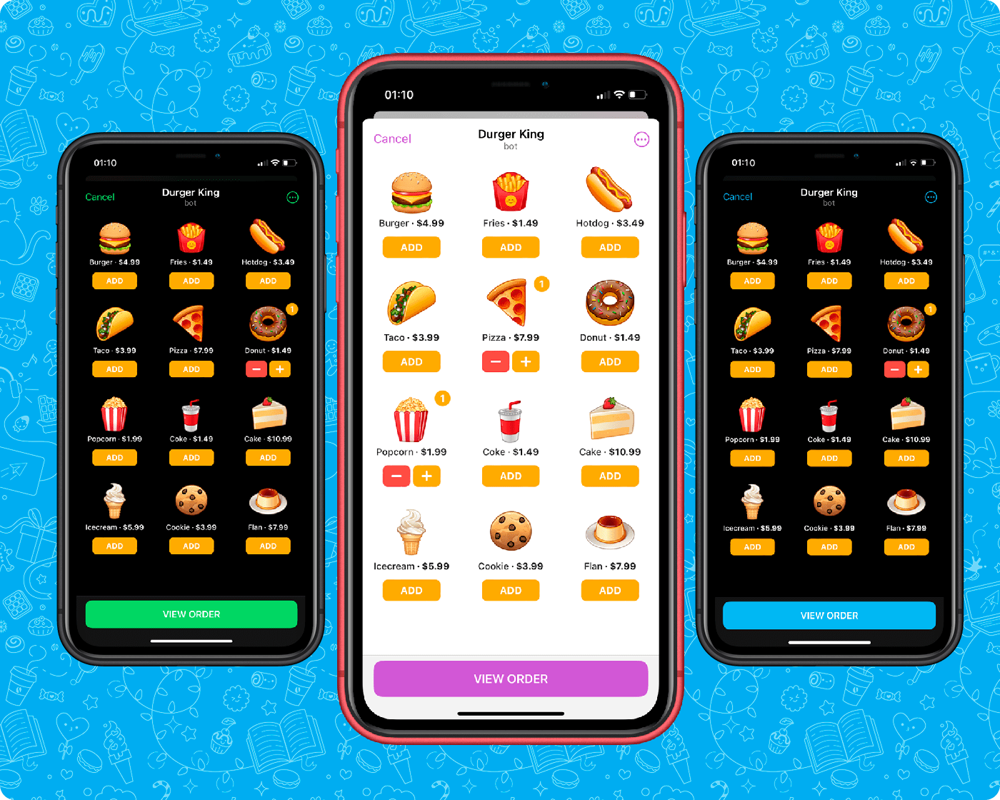

# Theming



Mini Apps are web applications designed to have a native appearance. This includes not only the use of components that mimic native elements but also the adoption of the parent application's color scheme.

Mini Apps are provided with colors that currently match those used in the Dejoy application. These colors should be utilized by Mini Apps to ensure a consistent and native look.

## Retrieving
### Launch Parameter
Dejoy Mini Apps provides theming data through a launch parameter known as [tgWebAppThemeParams](../launch-parameters/about.md#tgwebappthemeparams). This parameter represents a serialized JSON object containing a list of optional properties, with each property describing one of the palette colors.

Here is a complete example of the parameter value:

```
{
  "accent_text_color": "#6ab2f2",
  "bg_color": "#17212b",
  "button_color": "#5288c1",
  "button_text_color": "#ffffff",
  "bottom_bar_bg_color": "#ffffff",
  "destructive_text_color": "#ec3942",
  "header_bg_color": "#17212b",
  "hint_color": "#708499",
  "link_color": "#6ab3f3",
  "secondary_bg_color": "#232e3c",
  "section_bg_color": "#17212b",
  "section_header_text_color": "#6ab3f3",
  "subtitle_text_color": "#708499",
  "text_color": "#f5f5f5"
}
```
### Dejoy Mini Apps Method
Nevertheless, retrieving theming data via launch parameters is not the only way. Dejoy Mini Apps also permits obtaining the theme through a method called [web_app_request_theme](../apps-communication/methods.md#web_app_request_theme).

As a result of calling this method, Dejoy will emit an event named [theme_changed](../apps-communication/events.md#theme_changed). The payload of this event contains a property called ```theme_params```, which has the format described in the previous section.

## Background and Header Colors
As long as a Mini App is always displayed within a native component, which consists of parts such as the header and body, Dejoy Mini Apps also allows changing their colors.

To change the header color, developers should utilize the [web_app_set_header_color](../apps-communication/methods.md#web_app_set_header_color) method, which provides a way to set the color either by using a theme key or a custom RGB string.

To update the body color, it is required to use the [web_app_set_background_color](../apps-communication/methods.md#web_app_set_background_color) method.