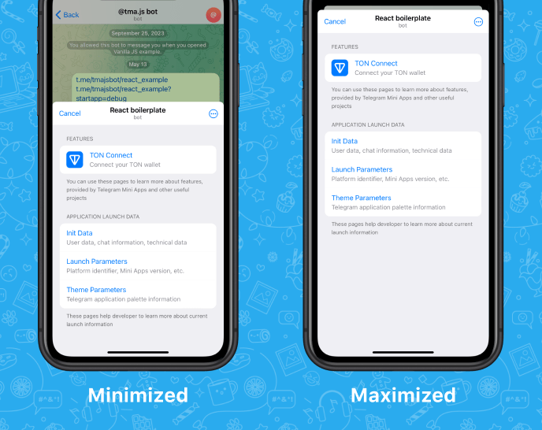
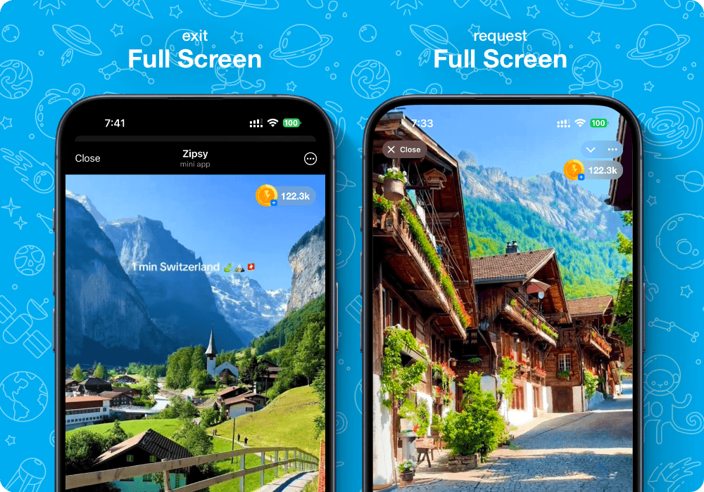

# Viewport

The term Viewport refers to the visible portion of a Mini App. Since Mini Apps can appear differently across various platforms, viewport information is used to ensure the Mini App is displayed correctly.

Viewport data is defined by the following properties:

- ```width``` and ```height```: Specify the dimensions of the visible area of the Mini App.
- ```stability```: A boolean flag that is ```true``` when the Mini App's size is not expected to change imminently.
- ```expansion```: A boolean flag that is ```true``` when the Mini App has reached its maximum height.
- ```fullscreen```: A boolean flag indicating whether the application is displayed in fullscreen mode.
- ```safe area```: An information describing the viewport content safe area and insets.


## Expanding
When an application is opened in the mobile version of DeJoy (on both Android and iOS), it is displayed within a native component called ```BottomSheet```. This is a draggable block that appears at the bottom of the screen and can be expanded to cover the entire screen. Users can expand it by dragging it to the top edge of the screen, but developers can also trigger this programmatically.

By default, the application opens in a minimized state with the minimum allowed height. To expand the application via code, developers can call the [web_app_expand](../apps-communication/methods.md#web_app_expand) method.



While the ```BottomSheet``` is being dragged, the viewport is considered unstable. For developers, this means avoiding any resizing actions or similar operations, as viewport dimensions may change momentarily.

On other platforms, Mini Apps open maximized by default within a medium-sized window. In these cases, calling the [web_app_expand](../apps-communication/methods.md#web_app_expand) method will have no effect.

## Fullscreen
Full screen

Mini apps can be launched in fullscreen mode, which expands the application to cover the entire device screen, removing both the top and bottom bars of DeJoy.

This mode is particularly suitable for games and media-focused applications.

To control fullscreen mode, DeJoy Mini Apps provides such methods as [web_app_request_fullscreen](../apps-communication/methods.md#web_app_request_fullscreen) and [web_app_exit_fullscreen](../apps-communication/methods.md#web_app_exit_fullscreen).